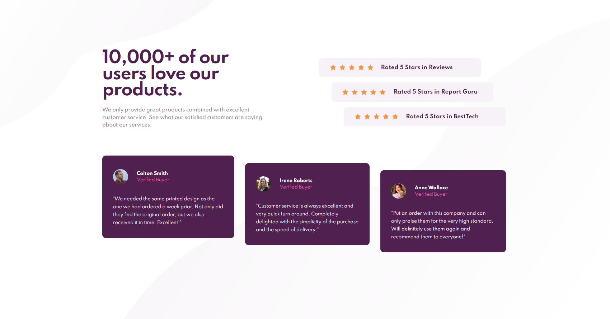
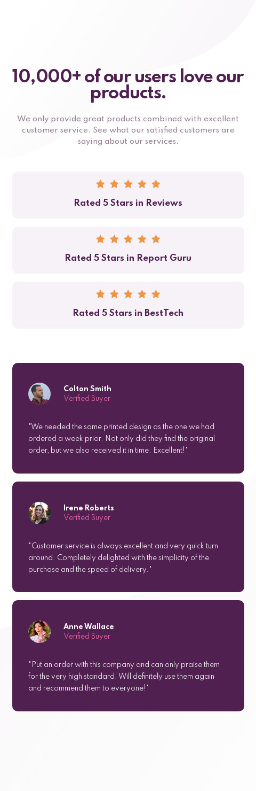

# Frontend Mentor - Social proof section solution

This is a solution to the [Social proof section challenge on Frontend Mentor](https://www.frontendmentor.io/challenges/social-proof-section-6e0qTv_bA). Frontend Mentor challenges help you improve your coding skills by building realistic projects. 

## Table of contents

- [Overview](#overview)
  - [The challenge](#the-challenge)
  - [Screenshot](#screenshot)
  - [Links](#links)
- [My process](#my-process)
  - [Built with](#built-with)
  - [What I learned](#what-i-learned)
  - [Continued development](#continued-development)
- [Author](#author)

## Overview

### The challenge

Users should be able to:

- View the optimal layout for the section depending on their device's screen size

### Screenshot

Desktop View

Mobile View

### Links

- Solution URL: [GitHub Code](https://github.com/MrRicram/social-proof-section)
- Live Site URL: [Live site url](https://mrricram.github.io/social-proof-section/)

## My process

### Built with

- Semantic HTML5 markup
- SCSS custom properties
- Flexbox
- Mobile-first workflow

### What I learned

Sometimes I tend to overcomplicate things which end up causing more difficulty while solving this challenges.

### Continued development

I'm focused on improving my front-end skills by doing more of this challenges.

## Author

- Website - Coming soon...
- Frontend Mentor - [@MrRicram](https://www.frontendmentor.io/profile/mrricram)
